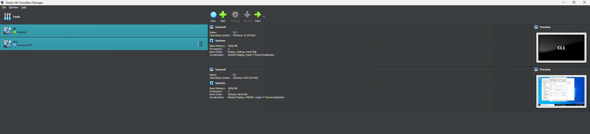
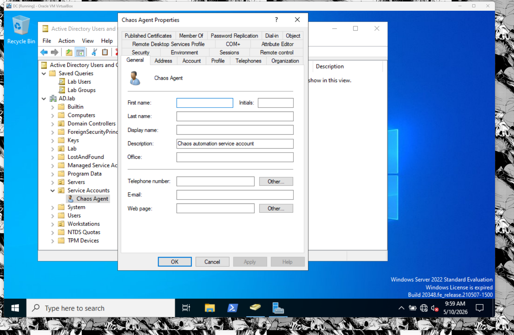
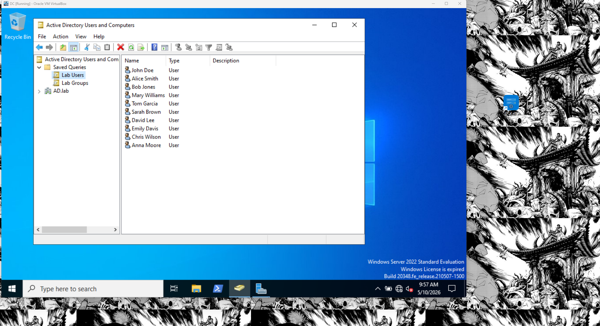
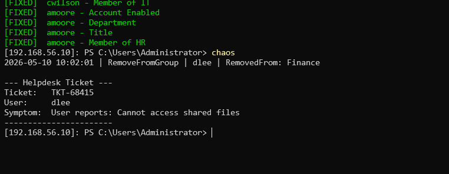
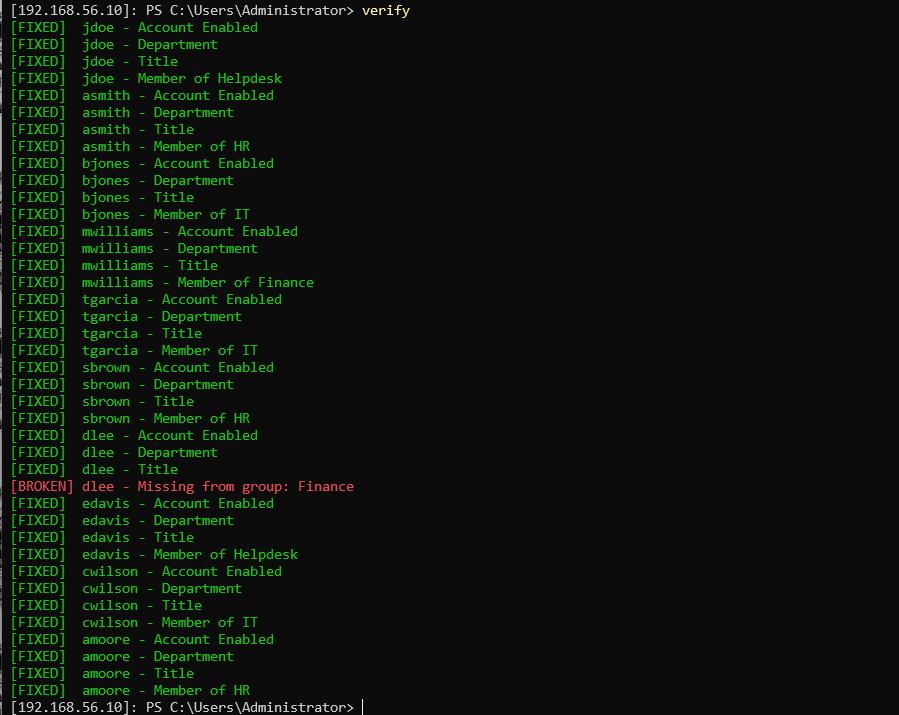
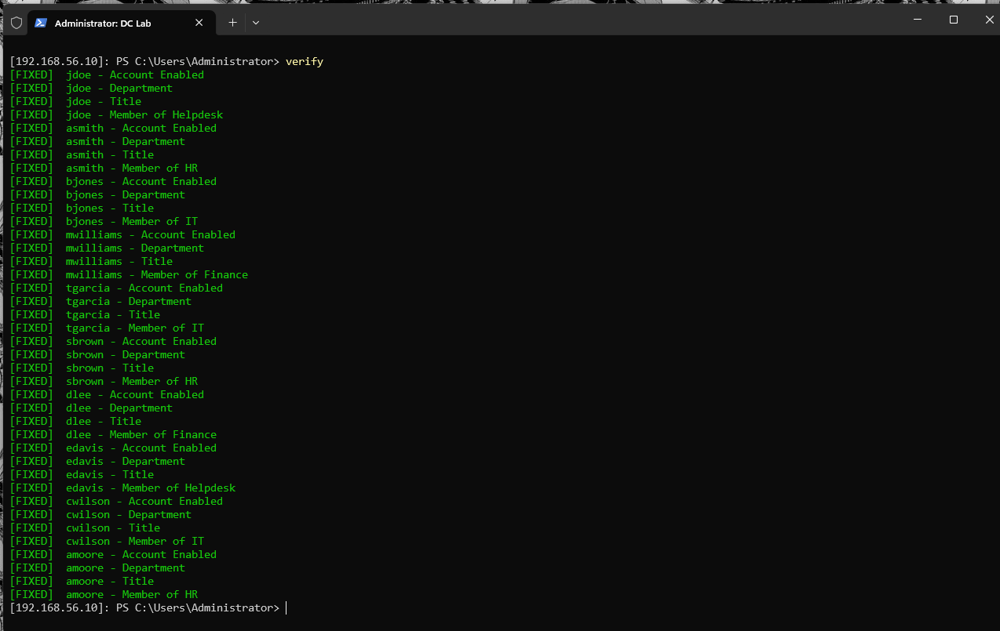
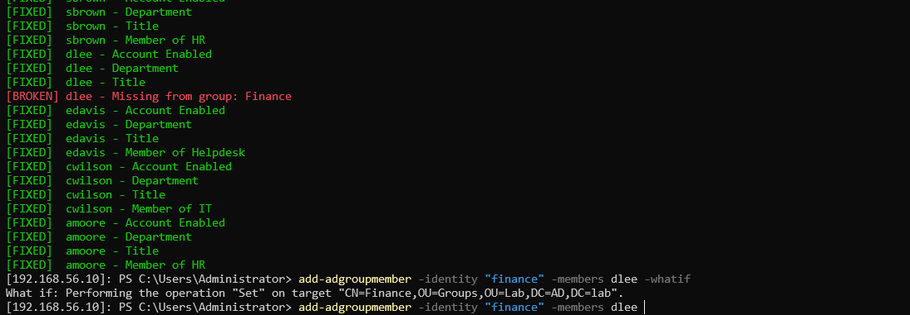

# Active Directory Lab - Chaos Agent v1

A controlled break-and-fix environment built on Windows Server 2022 Active Directory to practice AD administration and PowerShell automation in a repeatable, measurable way.

## What This Is

**Chaos Agent v1** is a PowerShell-driven Active Directory homelab designed to:

- Intentionally introduce controlled failures in a safe domain
- Verify those failures can be detected and recovered
- Build muscle memory for common AD troubleshooting and remediation workflows
- Establish a baseline that can be reverted and re-broken for repeated drilling

This is **not** a production environment, a security demonstration, or an advanced automation platform. It is a deliberate practice lab—infrastructure for learning.

## Environment

### Hardware & Hypervisor

```
Host OS:          Windows 10 Home / Windows 11
Hypervisor:       VirtualBox
Isolation:        Internal network (no internet)
```

### Virtual Machines

```
DC1               Windows Server 2022
 - IP:            192.168.100.10
 - Role:          Domain Controller (AD DS, DNS)
 - Storage:       ~40 GB
 - RAM:           2 GB minimum (4 GB recommended)

CLIENT1           Windows 10 Pro
 - IP:            192.168.100.20
 - Role:          Domain member workstation
 - Storage:       ~30 GB
 - RAM:           2 GB minimum
```



### Domain Structure

```
Domain:           AD.lab
Forest:           AD.lab (functional level: Windows Server 2016+)
DNS Backend:      Integrated DNS on DC1
Authentication:   Kerberos / NTLM
```

### Directory Layout

```
DC=AD,DC=lab
├── OU=Domain Controllers
├── OU=Workstations
├── OU=Servers
├── OU=Service Accounts
└── OU=Lab
    ├── OU=Groups
    │   ├── Helpdesk
    │   ├── HR
    │   ├── IT
    │   └── Finance
    └── OU=Users
        ├── John Doe (jdoe)
        ├── Alice Smith (asmith)
        ├── Bob Jones (bjones)
        ├── Mary Williams (mwilliams)
        ├── Tom Garcia (tgarcia)
        ├── Sarah Brown (sbrown)
        ├── David Lee (dlee)
        ├── Emily Davis (edavis)
        ├── Chris Wilson (cwilson)
        └── Anna Moore (amoore)
```

## Identity Layer

### Service Accounts

**Chaos Agent** (`svcchaos`)

```
Enabled:          True
DN:               CN=Chaos Agent,OU=Service Accounts,DC=AD,DC=lab
MemberOf:         (empty - remains low-privilege)
Purpose:          Future delegated execution for controlled failure injection
```



### Lab Users

10 test identities distributed across departments:

- **HR:** John Doe (jdoe), Alice Smith (asmith)
- **IT:** Bob Jones (bjones)
- **Finance:** Mary Williams, Tom Garcia, Sarah Brown, David Lee, Emily Davis, Chris Wilson, Anna Moore

All accounts are:
- Enabled by default
- Assigned to departments (Title, Department attributes)
- Members of relevant groups
- Used for break/fix scenarios and access testing



## How It Works

### The Cycle

```
1. BASELINE       Capture clean AD state as JSON snapshot
                  (OU structure, users, groups, attributes, memberships)

2. CHAOS          Introduce controlled failures via chaos.ps1
                  Examples:
                  - Disable users
                  - Lock accounts
                  - Change group memberships
                  - Expire passwords
                  - Modify attributes

3. DETECT         Run verify.ps1 to identify what broke
                  - Scan for disabled accounts
                  - Check locked-out users
                  - Verify group memberships
                  - Flag expired passwords
                  - Compare current state to baseline

4. REMEDIATE      Use PowerShell to fix issues
                  - Enable accounts
                  - Unlock accounts
                  - Reset passwords
                  - Restore group memberships
                  - Repair attributes

5. VERIFY         Run verify.ps1 again to confirm fixes
                  Compare against baseline
                  Document what broke and how it was fixed

6. RESET          Restore from baseline JSON snapshot
                  Revert all chaos
                  Prepare for next iteration
```

### Key Scripts

**`chaos.ps1`**

Introduces controlled failures. Examples:

```powershell
# Disable a random user
Get-ADUser -Filter * -SearchBase "OU=Users,OU=Lab,DC=AD,DC=lab" | 
  Get-Random | 
  Disable-ADAccount

# Lock a random account
Get-ADUser -Filter * | 
  Get-Random | 
  Set-ADUser -LockoutTime ([datetime]::UtcNow)

# Change group memberships
Get-ADUser -Filter "Department -eq 'HR'" | 
  Remove-ADGroupMember -Identity "HR" -Confirm:$false
```



Not yet implemented. Design patterns pending.

**`verify.ps1`**

Scans the current directory state and reports anomalies:

```powershell
# Find disabled users
Get-ADUser -Filter "Enabled -eq `$false" -SearchBase "OU=Users,OU=Lab,DC=AD,DC=lab"

# Find locked-out users
Get-ADUser -Filter "LockedOut -eq `$true"

# Check group memberships match baseline
# (Compare current groups against stored baseline.json)

# Report password-related issues
Get-ADUser -Properties PasswordExpired, PasswordNeverExpires |
  Where-Object { $_.PasswordExpired -eq $true }
```





Not yet implemented. Design patterns pending.

**`baseline.json`**

A structured snapshot of the clean domain state:

```json
{
  "CapturedAt": "2026-05-10T12:00:00Z",
  "Domain": "AD.lab",
  "OUs": [...],
  "Users": [
    {
      "Name": "John Doe",
      "SamAccountName": "jdoe",
      "Enabled": true,
      "Department": "HR",
      "MemberOf": ["HR", "Helpdesk"]
    },
    ...
  ],
  "Groups": [
    {
      "Name": "HR",
      "Members": ["jdoe", "asmith"]
    },
    ...
  ]
}
```

Captured once after setup, used as a reference point for `verify.ps1` comparisons and for resetting the lab.

**Remediation in action — fixing dlee's missing group membership:**



## Use Cases

### Daily Practice

```
- Scenario: "A user locked out. Find them, unlock them, verify."
  Command: Get-ADUser -Filter "LockedOut -eq `$true" | Unlock-ADAccount
  Verify:  Get-ADUser [samaccountname] | Select-Object LockedOut

- Scenario: "User's password expired. Reset it and force change at logon."
  Command: Set-ADAccountPassword -Identity [sam] -Reset
           Set-ADUser -Identity [sam] -ChangePasswordAtLogon $true
  Verify:  Get-ADUser [sam] -Properties PasswordExpired

- Scenario: "A user should be in IT group but isn't. Add them."
  Command: Add-ADGroupMember -Identity "IT" -Members [sam]
  Verify:  Get-ADGroupMember -Identity "IT" | Select-Object SamAccountName
```

### Break-Fix Cycles

```
1. Run chaos.ps1 (random failures)
2. Run verify.ps1 (identify issues)
3. Manually remediate using PowerShell
4. Run verify.ps1 again (confirm fixes)
5. Run reset script (revert to baseline)
6. Repeat
```

### Certification Prep

Use as a drill environment for AZ-104, Security+, or any AD-focused cert that requires hands-on remediation scenarios.

## Getting Started

### Prerequisites

- Windows 10 Home or Windows 11 host
- VirtualBox 7.0+
- 8 GB RAM (6 GB minimum)
- 80 GB free disk space
- Administrator access on host

### Setup Steps

1. **Create VMs**
   - Download Windows Server 2022 ISO
   - Create DC1 VM with 2 vCPU, 4 GB RAM, 40 GB disk
   - Download Windows 10 Pro ISO
   - Create CLIENT1 VM with 2 vCPU, 2 GB RAM, 30 GB disk

2. **Network Configuration**
   - Create an internal network called `labnet`
   - Assign DC1 NIC to `labnet`: `192.168.100.10/24`
   - Assign CLIENT1 NIC to `labnet`: `192.168.100.20/24`
   - Set CLIENT1 DNS to `192.168.100.10`

3. **AD DS Setup on DC1**
   - Install AD DS role
   - Promote to domain controller: `AD.lab`
   - Verify DNS zone created
   - Verify SYSVOL and NETLOGON shares

4. **Client Domain Join**
   - Join CLIENT1 to `AD.lab` domain
   - Use domain admin credentials (`AD\Administrator`)
   - Reboot and verify logon

5. **Directory Structure**
   - Create OUs matching the layout above
   - Create groups under `OU=Lab\OU=Groups`
   - Create users under `OU=Lab\OU=Users`
   - Assign group memberships
   - Set Department and Title attributes

6. **Capture Baseline**
   - Run baseline capture script
   - Save `baseline.json` in repo
   - Commit to Git

7. **Test Access**
   - Log in to CLIENT1 as `AD\jdoe`
   - Verify file shares (if configured)
   - Confirm group permissions work

### Scripts Location

On DC1, store scripts in:

```
C:\Scripts\
├── chaos.ps1
├── verify.ps1
├── baseline.ps1    (captures baseline.json)
└── reset.ps1       (restores from baseline.json)
```

## PowerShell Concepts Used

### Core AD Cmdlets

- `Get-ADUser`, `Get-ADGroup`, `Get-ADOrganizationalUnit`
- `Set-ADUser`, `Enable-ADAccount`, `Disable-ADAccount`
- `Set-ADAccountPassword`, `Unlock-ADAccount`
- `Add-ADGroupMember`, `Remove-ADGroupMember`
- `Get-ADGroupMember`

### Scripting Patterns

- **Filtering:** `-Filter` with `-SearchBase` for targeted searches
- **Piping:** Chaining commands with `|` to transform output
- **Looping:** `ForEach-Object` for bulk operations
- **Conditionals:** `if/elseif/else` for decision logic
- **JSON Export/Import:** `ConvertTo-Json` / `ConvertFrom-Json` for snapshots
- **Comparison:** Baseline vs. current state for anomaly detection

## What's Not Included

**This lab deliberately skips:**

- File shares and NTFS permissions (future v2)
- Group Policy (future iteration)
- Replication and multi-master (single DC only)
- PKI / certificate services
- Azure AD / hybrid cloud identity
- Network segmentation
- Threat detection or EDR
- Production hardening

These are valid next steps but are out of scope for v1's learning goal: basic AD remediation under pressure.

## Limitations & Gotchas

### Single Domain Controller

- No replication testing
- No failover scenarios
- Full dependency on one VM

### No File Share Layer

- Can't test access control enforcement
- Can't break/fix permission issues
- Group membership is theoretical until v2

### Password Complexity

- Default policy enforced; weak passwords rejected
- Temporary passwords must meet complexity rules
- Plan passwords accordingly when scripting

### VM Resource Constraints

- Slow first boot (indexing, Windows Updates)
- Disk I/O bottleneck if host is busy
- RAM constrained for multiple simultaneous sessions

### Snapshot Volatility

- AD database changes frequently if testing is active
- Baseline JSON can become stale fast if lab is heavily used
- Plan frequent baseline updates in workflows

## Version History

### v1 (Current)

- Core AD DS setup
- 10 test users across 4 departments
- 4 test groups with memberships
- Service account (svcchaos) for future automation
- Chaos/verify/reset script structure (scripts not yet complete)
- Baseline snapshot mechanism
- This documentation

## Future (v2+)

- File shares on DC1 with NTFS/share permissions
- Test access scenarios from CLIENT1
- Group Policy for password/lockout policies
- Additional test VMs (print server, file server, etc.)
- Replication lab (multi-DC environment)
- Integration with Azure AD

## Contributing & Usage

This is a personal learning lab, not a community project. Clone it if useful; extend it for your own practice.

If you use this as a foundation:

- Update paths and IPs to match your environment
- Document baseline captures before major changes
- Test all scripts in `-WhatIf` mode first
- Keep reset procedures working (critical for repeatability)
- Don't skip the baseline step

## License

MIT (use it, modify it, learn from it)

## Contact & Questions

This lab was built as a structured learning environment. For questions about AD concepts or PowerShell patterns, refer to:

- Microsoft Docs: AD DS Administration
- Microsoft Learn: Introduction to AD DS
- PowerShell docs: `Get-Help [cmdlet] -Full`

---

**Last Updated:** May 2026  
**Status:** v1 identity layer complete; chaos/verify scripts pending  
**Next Session Focus:** File share implementation and access testing
